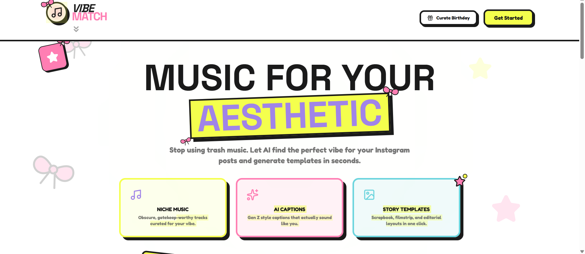

# VibeMatch 🎵✨

VibeMatch is an AI-powered aesthetic curation tool that analyzes the vibe of your photos and generates visually appealing Instagram story templates paired with niche music recommendations.

The goal of this project is to transform everyday moments — whether it's an outfit check, a memory with friends, or a birthday surprise — into aesthetic, story-ready digital scrapbooks.

  

---

## ✨ About The Project

Social media stories are often created quickly without much thought to aesthetic consistency or music selection. VibeMatch explores the idea of **AI-assisted aesthetic curation**, where a system analyzes visual elements of a photo and suggests:

- A matching visual template
- A curated music vibe
- A caption aligned with the mood

The project is an experiment in combining **AI, visual storytelling, and frontend design** to build a playful creative tool.

This repository showcases the **concept, design, and technical implementation** of that idea.

---

## 🚀 Features

### AI Vibe Analysis
Using Google Gemini, the system analyzes the **colors, setting, and overall mood** of a photo to determine its aesthetic.

### Niche Music Curation
Instead of generic recommendations, the tool surfaces **niche, aesthetic-matching music** that complements the vibe of the image.

### Story Templates
Users can choose from multiple visual layouts including:

- Editorial
- Filmstrip
- Scrapbook
- Minimal aesthetic templates

### Birthday Mode
A special storytelling mode for birthdays that allows:

- Personalized story templates
- AI-generated birthday wishes
- Voice note integration

### Voice Recording
Users can record a short message that becomes part of the shared story experience.

### Multi-Image Support
Combine **up to four photos** in a single story layout.

### Gen-Z Captions
AI-generated captions designed to match modern social media tone and expression.

---

## 🛠 Tech Stack

**Frontend**

- React
- TypeScript
- Tailwind CSS
- Framer Motion

**Backend**

- Node.js
- Express.js

**AI Integration**

- Google Gemini API (`@google/genai`)

**UI & Design**

- Brutalist inspired interface
- Lucide React icons
- Responsive layout

---

## 🧠 Project Concept

VibeMatch explores how **AI can assist creative decision-making** in everyday social media usage.

Rather than fully automating content creation, the goal is to **augment personal creativity** by helping users discover:

- new music
- visual styles
- caption ideas
- storytelling formats

The project focuses heavily on **aesthetic experimentation and user experience design**.

---

## ⚠️ Disclaimer

This project was created **purely for experimentation and fun**.

VibeMatch is not intended to:

- replace personal creativity
- enforce specific aesthetic standards
- dictate how users should share their stories

It simply provides **suggestions and creative inspiration**.

Users are always free to create and share stories however they prefer.

---

## 🔒 Usage Notice

This repository is shared for **demonstration and portfolio purposes only**.

The code, design, and concept are the intellectual property of the author.

**All rights reserved.**

You may view the project for educational or reference purposes, but redistribution, modification, or commercial use without permission is not allowed.

---

## 👩‍💻 Author

**vaibhavi-agale**

GitHub:  
https://github.com/vaibhavi-0320

---

## 🌱 Future Ideas

Potential future explorations for the concept include:

- mood-based playlist generation
- AI aesthetic clustering
- collaborative story creation
- social vibe matching
- advanced template personalization

---

## 💭 Final Note

VibeMatch started as a simple question:

*"What if AI could help curate the vibe of your memories?"*

This project is a small step toward exploring that idea.
